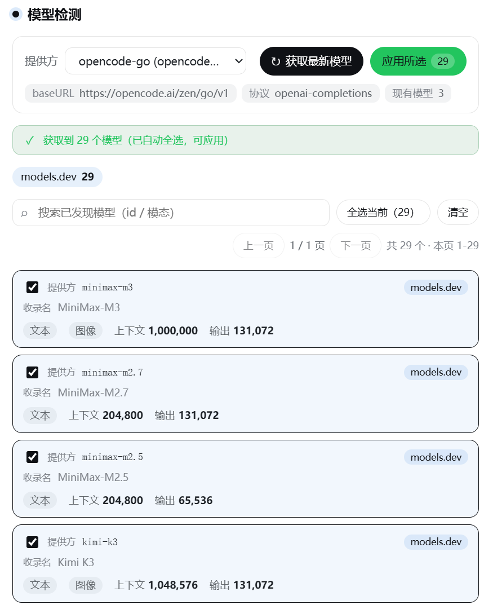

# dsh-model-detector

**简体中文** · [English](README_en.md)

[](LICENSE)
[](package.json)



---

# 中文文档

## 定位

为任意 **pi-ai 提供方**检测其线上最新模型，并用 **models.dev** 自动富化正确元数据（模态 `text/image`、上下文容量、输出上限、推理能力）后写回该提供方。入口：**设置 → 模型检测**。

## 特性

- **实时拉取**：直接打提供方 `/models`，拿到线上最新模型 id，无视模板目录的滞后。
- **能力自动富化**：以 **models.dev** 为唯一权威能力源（上下文 / 输出 / 模态 / 推理），跨提供方回退，聚合网关亦可命中。
- **思考档位按模型富化**：从 models.dev `reasoning_options` 读取每个模型自己的推理等级（如 Muse Spark → Minimal/Low/Medium/High/Xhigh、Qwen3.8 Flash → Low/Medium/Xhigh、Kimi K3 → Max），翻译成 DSH 的 `reasoningEfforts` 写回，让第三方模型在 DSH 中可设置思考强度。**绝不套用统一档位**；纯开关/无档位模型不写，交给 pi-ai 目录兜底。
- **四级优先级**：当前提供方 models.dev → 全局 models.dev → 内置 manifest（薄覆盖）→ 保守默认。
- **卡片式交互**：分页 + 搜索防抖 + 勾选应用，海量模型不卡顿；每张卡清晰标注数据来源与推理档位。
- **来源透明**：区分「查得到」与「默认兜底」，models.dev 未收录时给出提示，不把默认当查得。

## 为什么做这个

DSH 原生对 pi-ai「模板（目录）提供方」的发现只回答**内置目录**（滞后，且可能缺失新模型）；对「自定义提供方」只走线上 `/models`，**拿不到模态**（线上端点不声明模态）。两者都无法同时给出「**最新模型 + 正确模态**」。

本插件把这两件事拼起来：

```
线上 GET /models（最新 id）
    ↓ 合并
models.dev（自动、社区维护的模态/容量/推理/思考档位）—— 主源
    ↓ 覆盖
内置 manifest（薄覆盖，仅兜底 models.dev 缺/错的个别模型；thinkingLevelMap 人工档位优先）
    ↓ 兜底
保守默认（text + 262144 / 32768）
```

**模态归一化**：models.dev 可能标注 `video/pdf/audio`，而 DSH 只支持 `text/image`，插件归一为——含 `image` → `[text, image]`，否则 `[text]`。

**思考档位 → DSH reasoningEfforts**：DSH 对模型的思考强度由 profile 层的 `reasoningEfforts`（档位 → wire 值）驱动，菜单只显示适配器公布的档位。插件从 models.dev `reasoning_options` 读取每个模型声明的档位（wire 值 = 档位名，`none` → `off`），manifest 的人工 `thinkingLevelMap` 优先（如 deepseek 的 `{high, max}` + `compat.thinkingFormat: deepseek`）。只有档位声明（非纯开关）才写，且只保留 pi-ai 词汇表（off/minimal/low/medium/high/xhigh/max）内的档位，避免 DSH 校验拒绝整个提供方。

**来源判定**：每个模型合并后标 `source`：

| source | 含义 |
|---|---|
| `models-dev` | 命中 models.dev（权威社区数据，含跨厂商回退） |
| `manifest` | 命中内置薄覆盖清单（dsh 专属字段 + 缺口） |
| `default` | 未收录，保守默认 |

## 安装

**推荐：从 npm registry 安装**（`npm:dsh-model-detector`）

```sh
dsh plugin --profile web add npm:dsh-model-detector
```

安装后**重启 `dsh web`** 并刷新页面，设置页左侧出现「**模型检测**」。

> 其它来源：GitHub 源 `dsh plugin --profile web add github:1204244136/dsh-model-detector`，或本地联调 `dsh plugin --profile web add link:C:\path\to\dsh-model-detector`。

## 使用

1. 打开 **设置 → 模型检测**。
2. **选择提供方**（下拉列出你已配置的所有 pi-ai 提供方，如 `opencode-go`、`tokenrhythm`、`volcengine`）。
3. 点「**获取最新模型**」——插件拉取该提供方 `/models`，用 models.dev 富化模态 / 容量 / 推理。
4. 在分页列表里**搜索或勾选**想要保留的模型（`vision`、`kimi`、`image` 等关键词可快速定位）。
5. 点「**应用所选**」——把富化后的模型写进该提供方的 `models` 列表（自动补齐缺失的 `api` / `baseURL`，使提供方自足）。

> 说明：插件会解析提供方的 `apiKeyEnv` 凭据去请求 `/models`（如 `volcengine` 需带 key，否则 401）。线上拉取失败时**只回退** models.dev / 内置清单，**绝不用该提供方的旧配置兜底**（本插件的目的是拿"线上"信息）。

## 性能特性

- **分页渲染**：每页 80 行 + 上一页 / 下一页 + 范围显示，DOM 只渲染一页。
- **搜索防抖**：已发现列表的搜索 300ms 防抖，不逐键重渲染大数组。
- **不自动全选海量结果**：结果 ≤200 才自动全选；更大则提示手动勾选。

## Host API

插件注册 `webServer` 前缀路由 `/dsh-model-detector/api`：

| 方法 | 路径 | 作用 |
|---|---|---|
| `GET` | `/providers` | 列出已配置的 pi-ai 提供方（route/displayName/api/baseURL/模型数） |
| `POST` | `/discover` | 拉取该提供方 `/models` + models.dev 富化 → 返回富化模型列表 |
| `POST` | `/apply` | 把所选模型写入 `llm-pi-ai.providers.<route>.models` |

`/discover` 响应还带诊断字段：`modelsDevLoaded` / `modelsDevProviders` / `modelsDevError` / `providerInModelsDev` / `sourceCounts`，便于区分来源，避免把「默认」误当「查得」。

此外提供一个只读 agent 工具 `_dsh_model_detector_status`（查询各提供方概览）。

## 配置

插件 `Config` 仅一个字段：

```yaml
# profile cordis.patch.yml 覆盖
- override:
    - id: dsh-model-detector
      config:
        title: 模型检测   # 设置页标题
```

## 仓库结构

```
├── package.json        bundle 清单（dsh.bundle.patch / dsh.client / exports）
├── cordis.patch.yml    bundle patch:把 host 行 dsh-model-detector 插入组合
├── docs/preview.png    设置页效果图
├── lib/                构建产物（host lib/index.js + client lib/client.js）
├── src/
│   ├── index.ts        host 入口：webServer API + 状态工具
│   ├── api.ts          host 业务：发现合并（models.dev/清单/默认 + source 判定）+ 应用写入
│   ├── manifest.ts     内置薄覆盖清单（可扩展任意提供方）
│   └── client/         React 设置页（DSH 设计语言）+ 样式
└── scripts/build.sh    host tsc 构建（DSH_CHECKOUT）
```

## 许可证

[MIT](LICENSE)
